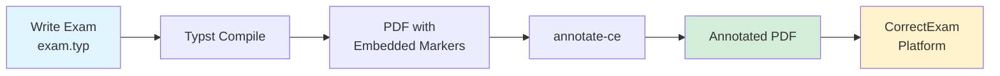

# CorrectExam Typst Tooling

[](https://github.com/correctexam/correctexam-typst-template/actions)
[](https://github.com/correctexam/correctexam-typst-template/releases)
[](https://typst.app/)
[](LICENSE)

> **Modern exam generation and machine-grading toolchain for Typst**

This workspace provides a complete solution for creating machine-readable exams compatible with the [CorrectExam](https://correctexam.github.io/) grading platform. It combines a powerful Typst template package with a Rust-based PDF annotation tool.

## 🎯 Features

- **📝 Typst Template Package**: Write exams with type-safe, elegant syntax
- **🤖 Machine-Readable PDFs**: Automatic zone marking for digital grading
- **🔧 Annotation Tool**: Rust CLI (`annotate-ce`) for embedding grading metadata
- **🌍 Multi-Language**: Built-in support for English and French
- **✅ QCM Support**: Multiple-choice questions with automatic layout
- **📦 Self-Contained**: Embeds all metadata in PDF attachments
- **🎨 Customizable**: Extensible template system with custom content boxes
- **⚡ Fast Compilation**: Leverages Typst's incremental compilation

## 📋 Table of Contents

- [Components](#-components)
- [Quick Start](#-quick-start)
- [End-to-End Workflow](#-end-to-end-workflow)
- [Installation](#-installation)
- [Documentation](#-documentation)
- [Examples](#-examples)
- [Development](#-development)
- [Contributing](#-contributing)
- [License](#-license)

## 🧩 Components

This workspace is split into two complementary projects:

### 1. `correctexam-typst-template/`

**Typst package for exam authoring**

Write exams using intuitive Typst markup with automatic zone detection, identity fields, and corner markers for machine grading.

**Key Features**:
- Question blocks with automatic numbering
- Answer boxes (lined, spaced, or custom)
- QCM (multiple-choice) support
- Anonymous and identified exam modes
- Custom content boxes (info, warning, note)
- Embedded marker metadata

**[📖 Full Documentation →](correctexam-typst-template/README.md)**

### 2. `annotate-typst/`

**Rust CLI/library for PDF annotation**

Reads embedded marker metadata from compiled PDFs and writes CorrectExam annotations to the PDF info dictionary for seamless pipeline integration.

**Key Features**:
- Reads `correctexam-markers.json` PDF attachment
- Writes annotations to PDF `/Info` dictionary
- Cross-platform binaries (Linux, macOS, Windows)
- Optional WASM compilation for web integration

**[📖 Full Documentation →](annotate-typst/README.md)**

## 🚀 Quick Start

### Prerequisites

- **Typst** ≥ 0.14.0 ([installation guide](https://github.com/typst/typst#installation))
- **Rust** (latest stable) for building `annotate-ce` ([rustup.rs](https://rustup.rs/))

### Basic Usage

```bash
# 1. Compile a Typst exam
typst compile --root correctexam-typst-template \
  correctexam-typst-template/examples/exam-en.typ \
  exam.pdf

# 2. Build the annotation tool (one-time setup)
cargo build --release --manifest-path annotate-typst/Cargo.toml

# 3. Annotate the PDF
./annotate-typst/target/release/annotate-ce \
  exam.pdf \
  -o exam.annotated.pdf

# 4. Upload exam.annotated.pdf to CorrectExam
```

### Using Pre-Built Binaries

Download platform-specific `annotate-ce` binaries from the [Releases page](https://github.com/correctexam/correctexam-typst-template/releases):

```bash
# Linux/macOS
chmod +x annotate-ce-*
sudo mv annotate-ce-* /usr/local/bin/annotate-ce

# Verify
annotate-ce --version
```

## 🔄 End-to-End Workflow



1. **Author**: Write your exam using the Typst template
2. **Compile**: Typst embeds `correctexam-markers.json` as PDF attachment
3. **Annotate**: `annotate-ce` reads markers and writes to PDF info
4. **Upload**: Import the annotated PDF into CorrectExam

## 📦 Installation

### Install Typst Package (Local)

```bash
# Clone this repository
git clone https://github.com/correctexam/correctexam-typst-template.git
cd correctexam-typst-template

# Use with --root flag
typst compile --root correctexam-typst-template \
  your-exam.typ \
  output.pdf
```

### Install from Typst Universe (Coming Soon)

```typst
#import "@preview/correctexam:0.1.0": *
```

### Build Annotation Tool

```bash
# Build release binary
cargo build --release --manifest-path annotate-typst/Cargo.toml

# Binary location
./annotate-typst/target/release/annotate-ce

# Optional: Install globally
cargo install --path annotate-typst
```

## 📚 Documentation

### Template Package
- **[Complete Guide](correctexam-typst-template/README.md)** - 995-line comprehensive documentation
- **[API Reference](correctexam-typst-template/README.md#-api-reference)** - All 12 functions documented
- **[FAQ](correctexam-typst-template/README.md#-faq)** - Common questions (Why Typst? Why large margins?)
- **[Best Practices](correctexam-typst-template/README.md#-best-practices)** - Writing effective exams
- **[Troubleshooting](correctexam-typst-template/README.md#-troubleshooting)** - Common issues

### Annotation Tool
- **[annotate-ce README](annotate-typst/README.md)** - CLI usage and library interface
- **[Contributing Guide](CONTRIBUTING.md)** - Development workflow
- **[Changelog](CHANGELOG.md)** - Version history
- **[GitHub Actions](. github/README.md)** - CI/CD workflows

## 🎨 Examples

### Minimal Example

```typst
#import "/lib/lib.typ": correctexam, question-inline, answer-lines

#show: correctexam.with(
  title: [Final Exam: Introduction to Computer Science],
  subject: [CS101],
  year: [2024],
  duration: [2 hours],
)

#question-inline(points: 5)[
  Explain the difference between a stack and a queue.
]
#answer-lines(5)
```

### Available Examples

All examples include detailed comments:

- **[exam-en.typ](correctexam-typst-template/examples/exam-en.typ)** - Full-featured English exam (62 comment lines)
- **[exam-fr.typ](correctexam-typst-template/examples/exam-fr.typ)** - Full-featured French exam
- **[exam-anonymous.typ](correctexam-typst-template/examples/exam-anonymous.typ)** - Anonymous exam mode
- **[quickstart/exam-en.typ](correctexam-typst-template/quickstart/exam-en.typ)** - Minimal starter
- **[quickstart/exam-fr.typ](correctexam-typst-template/quickstart/exam-fr.typ)** - Minimal starter (French)

### Compile Examples

```bash
cd correctexam-typst-template

# English example
typst compile --root . examples/exam-en.typ build/exam-en.pdf

# French example
typst compile --root . examples/exam-fr.typ build/exam-fr.pdf

# Anonymous mode
typst compile --root . examples/exam-anonymous.typ build/exam-anonymous.pdf
```

## 🛠️ Development

### Run Tests

```bash
# Rust tests
cd annotate-typst && cargo test

# Typst compilation tests
cd correctexam-typst-template && ./tests/validate.sh

# Integration test
./scripts/integration-test.sh  # If available
```

### Local Development

```bash
# Watch mode for Typst
typst watch --root correctexam-typst-template \
  your-exam.typ \
  output.pdf

# Rust development build
cd annotate-typst && cargo build
```

### CI/CD

This project uses GitHub Actions for:

- **Continuous Integration**: Automated testing on all PRs
- **Release Automation**: Cross-platform binary builds on tag push
- **Artifact Publishing**: GitHub Releases with binaries and packages

See [`.github/README.md`](.github/README.md) for workflow details.

## 🤝 Contributing

Contributions are welcome! Please read our [Contributing Guide](CONTRIBUTING.md) for:

- Development setup
- Code style guidelines
- Testing requirements
- PR submission process
- Release workflow

### Quick Contribution Checklist

- [ ] Fork the repository
- [ ] Create a feature branch (`feature/awesome-feature`)
- [ ] Write tests for your changes
- [ ] Ensure all tests pass (`cargo test`, Typst compilation)
- [ ] Follow commit message conventions
- [ ] Submit a Pull Request to `develop` branch

## 📄 License

This project is licensed under the **MIT License** - see the [LICENSE](LICENSE) file for details.

## 🔗 Links

- **GitHub Repository**: [correctexam/correctexam-typst-template](https://github.com/correctexam/correctexam-typst-template)
- **Issue Tracker**: [GitHub Issues](https://github.com/correctexam/correctexam-typst-template/issues)
- **Releases**: [GitHub Releases](https://github.com/correctexam/correctexam-typst-template/releases)
- **CorrectExam Platform**: [correctexam.github.io](https://correctexam.github.io/)
- **Typst Documentation**: [typst.app/docs](https://typst.app/docs)

## ❓ Support

- **Documentation**: Check the comprehensive [README](correctexam-typst-template/README.md)
- **FAQ**: See [common questions](correctexam-typst-template/README.md#-faq)
- **Issues**: Report bugs on [GitHub Issues](https://github.com/correctexam/correctexam-typst-template/issues)
- **Discussions**: Ask questions in [GitHub Discussions](https://github.com/correctexam/correctexam-typst-template/discussions)

---

**Made with ❤️ for educators using [Typst](https://typst.app/)**

- `correctexam-typst-template/examples/exam-fr.typ`

They mirror the historical LaTeX examples and include answer boxes, QCM zones, inline answers, references, and copyable figure content.
